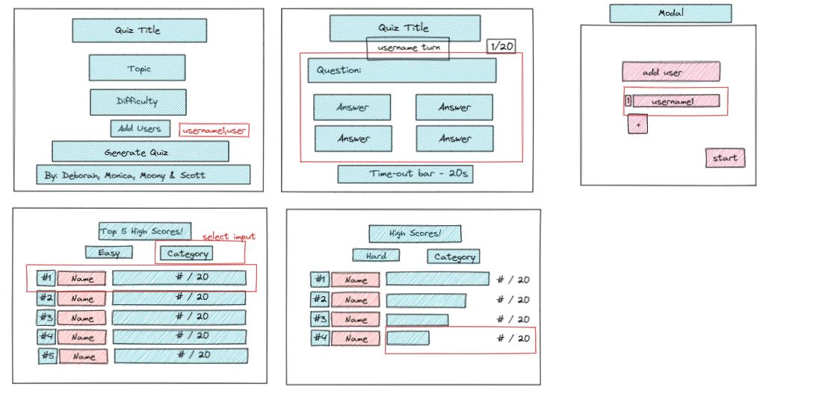
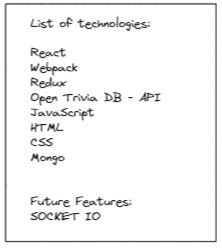
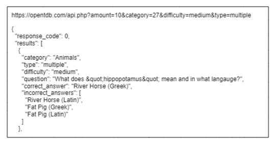
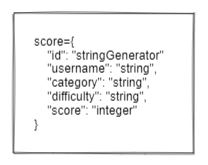

# Changelog

## Planing 

  
<b>sketch in excalidraw</b>

  

- distributed model with forks and branches in github

  
<b>choose technologies more or less</b>

  

  
<b>got a sample of the trivial api</b>

  

  
<b> design the json for the scores</b>

  

- set up the presentation file 

## Client
- upload stud files
- do the add user modal

## Misc
- add Readme
- add License
- add Changelog
